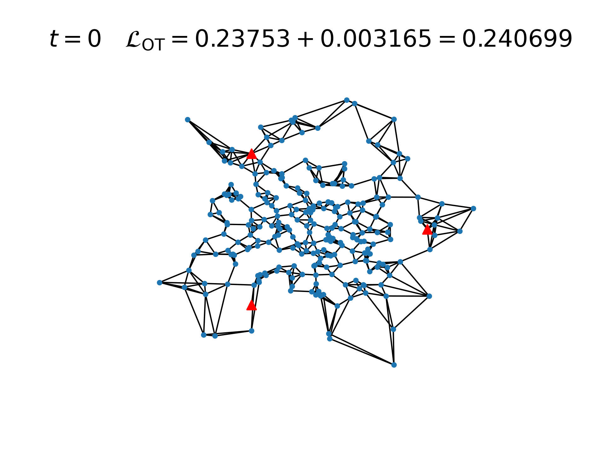

# E(*n*)-equivariant Graph Cellular Automata

This repository is a fork of https://github.com/gengala/egnca attempting to improve model expressiveness and remove fixed edges during training

**N.B.** Sometimes GIFs are not properly loaded in `README.md`. Please refresh the page.  

## Angles

    python -m trainers.geometric_graph -ds Grid2d -sdg 0.05 -rdg 1.0 -bsc 0 8 2000 16 4000 32 -pats 800 -an --seed 42
    python -m trainers.geometric_graph -ds Grid2d -sdg 0.05 -rdg 1.0 -bsc 0 8 2000 16 4000 32 -pats 800     --seed 42

## Local loss

Non-persistent           |  Persistent
:-------------------------:|:-------------------------:
 | 

    python -m trainers.geometric_graph -ds Grid2d -bsc 0 1 -l local -an --seed 42
    python -m trainers.geometric_graph -ds Grid2d -bsc 0 8 2000 16 4000 32 -pats 800 -l local -an --seed 42

### Anchors

    python -m trainers.geometric_graph -ds Grid2d -bsc 0 1 -l local -ss -as corners -an --seed 42
    python -m trainers.geometric_graph -ds Grid2d -bsc 0 1 -l local -ss -as corners -asc 1.5 -an --seed 42
    python -m trainers.geometric_graph -ds Grid2d -bsc 0 1 -l local -ss -as simplex -an --seed 42

### Penalty

    python -m trainers.geometric_graph -ds Grid2d -bsc 0 4 -l local_enp -an --seed 42
    python -m trainers.geometric_graph -ds Grid2d -bsc 0 8 2000 16 4000 32 -l local_enp -pd 0.3 -ss -as corners -asc 1.5 -an --seed 42

### Different targets

<!--  -->

IF the gif does not load, check it out here: https://drive.google.com/uc?export=view&id=1plY13LX7eWIIyKf01JtWft24_8qHUZPa

    python -m trainers.geometric_graph -ds Cube -sdg 0.05 -rdg 1.0 -bsc 0 2 -l local_enp -pd 0.2 -ss -as corners -ad 0.15 -asc 0.5 -an --seed 42
    python -m trainers.geometric_graph -ds Torus -bsc 0 8 2000 16 -l local_enp -an -at undirected -ss -as corners -ad 0.5
    python -m trainers.geometric_graph -ds x_small -bsc 0 8 2000 16 4000 32 -l local_enp -pd 0.2 -ss -as corners --seed 42

## OT-based loss
### Anchors

    python -m trainers.geometric_graph -ds Grid2d -bsc 0 1 -l ot -ss -as simplex --seed 42

### Penalty

    python -m trainers.geometric_graph -ds Grid2d -bsc 0 1 -l ot_p -ss -as simplex --seed 42 -nt nn

### Static and dynamic relative edges
#### Static

    python -m trainers.geometric_graph -ds Grid2d -bsc 0 1 -l ot_p -ss -as simplex -re -en 4 --seed 42 -nt nn

#### Dynamic, every step

    python -m trainers.geometric_graph -ds Grid2d -bsc 0 1 -l ot_p -ss -as simplex -re -de -en 4 --seed 42

#### Dynamic, every 5 steps

    python -m trainers.geometric_graph -ds Grid2d -bsc 0 8 2000 16 -l ot_p -pd 0.3 -an -ss -as corners -re -de -en 4 -des 5 -ad 0.3 --seed 42
    python -m trainers.geometric_graph -ds Grid2d -bsc 0 8 2000 16 -l ot_p -pd 0.3     -ss -as simplex -re -de -en 4 -des 5 -ad 0.3 --seed 42

#### Dynamic, no penalty

    python -m trainers.geometric_graph -ds Grid2d -bsc 0 1 -l ot -at undirected -an -ffa -ss -as corners -asc 1.5 -uaf -re -de -des 5 -en 5 --seed 123

### Beacons
#### No persistency

    python -m trainers.geometric_graph -ds Grid2d -bsc 0 1 -l ot_p -apd -an -bc -as simplex -re -de -en 4 -des 5 --seed 42'
    python -m trainers.geometric_graph -ds Grid2d -bsc 0 1 -l ot_p -pd 0.3 -bc -as simplex -re -de -en 4 -des 5 --seed 42 -nt nn
    python -m trainers.geometric_graph -ds Grid2d -bsc 0 1 -l ot_p -pd 0.4 -bc -as simplex -re -de -en 4 -des 5 --seed 42 -nt nn
    python -m trainers.geometric_graph -ds Grid2d -bsc 0 1 -l ot_p -pd 0.5 -bc -as simplex -re -de -en 4 -des 5 --seed 42 -nt nn

#### Persistency

<!--  -->

IF the gif does not load, check it out here: https://drive.google.com/uc?export=view&id=1v0uKqbdVi8sYXpQh4ufRqNDLKZV7iQM7

    python -m trainers.geometric_graph -ds Grid2d -bsc 0 8 2000 16 4000 32 -l ot_p -apd -bc -as simplex -re -de -en 4 -des 5 --seed 42 -nt nn
    python -m trainers.geometric_graph -ds Grid2d -bsc 0 8 2000 16 4000 32 -l ot_p -pd 0.3 -bc -as simplex -re -de -en 4 -des 5 --seed 42 -nt nn
    python -m trainers.geometric_graph -ds Grid2d -bsc 0 8 2000 16 4000 32 -l ot_p -pd 0.4 -bc -as simplex -re -de -en 4 -des 5 --seed 42 -nt nn
    python -m trainers.geometric_graph -ds Grid2d -bsc 0 8 2000 16 4000 32 -l ot_p -pd 0.5 -bc -as simplex -re -de -en 4 -des 5 --seed 42 -nt nn

### Robustness
All robustness experiments are performed with the same model:

    python -m trainers.geometric_graph -ds Grid2d -bsc 0 8 2000 16 4000 32 -l ot_p -pd 0.3 -bc -as simplex -re -de -en 4 -des 5 --seed 42 -nt nn

#### Random initial coordinates

#### Damage

Local damage               | Global damage
:-------------------------:|:-------------------------:
 | 

#### Increased or decreased node count

<!--  -->

IF the gif does not load, check it out here: https://drive.google.com/uc?export=view&id=140wQ-GTYflekb7xVrBeOxdZHsupSkGIJ

#### Decreased fire rate

<!--  -->

IF the gif does not load, check it out here: https://drive.google.com/uc?export=view&id=1qUGOCaR8KIUvhIQ5yuampMZqxfGTuVsr

#### Rotated structured seeds
E(*n*) Convergence to 2D-Grid           |  Adapting to rotated structured seeds
:-------------------------:|:-------------------------:
  | 

### Different targets
#### X and a

#### Cube and Torus

For testing, play with `notebooks/test_geometric_graph.ipynb` and `notebooks/visualise_results.ipynb`.

